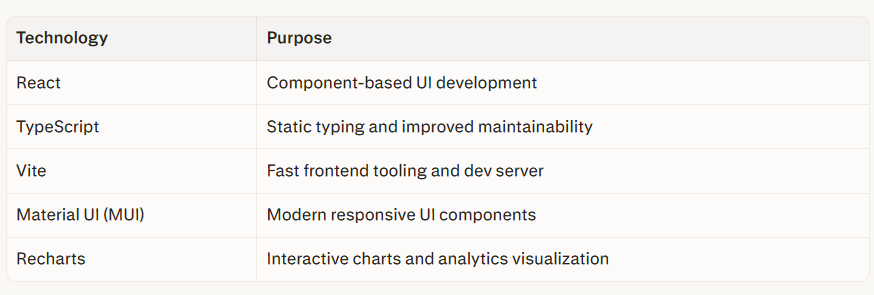
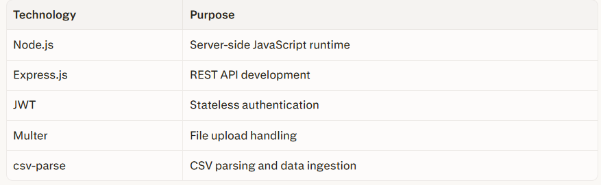

🚀 Overview
Financial Risk Analytics Platform (branded as FinRisk Insight) is a full-stack FinTech web application designed to help users upload financial datasets, analyze portfolio risk, and visualize important risk indicators through an interactive dashboard.

The platform combines secure authentication, financial data ingestion, portfolio risk analytics, and modern dashboard visualization into one professional web system. It is designed to simulate the kind of internal analytics tooling used in financial institutions, wealth management teams, or risk monitoring environments.

Why this project matters
In real-world finance, understanding portfolio risk is essential for making informed decisions. This platform helps convert raw CSV-based market or portfolio data into meaningful insights such as:

i. Value at Risk (VaR)
ii. Volatility
iii. Maximum Drawdown
iv. Risk Score
v. Visual trend analysis
vi. Dataset-level monitoring and administration

This project demonstrates the intersection of:
i. Full-stack software engineering
ii. Secure authentication systems
iii. REST API design
iv. Financial analytics logic
v. Data visualization
vi. Role-based access control

Production-style project structuring

✨ Key Features
🔐 Authentication & Authorization
i. User registration and login
ii. JWT-based authentication
iii. Protected frontend and backend routes
iv. Role-based access control (Admin/User)
v. Session-aware dashboard access

📂 Data Upload & Management
i. CSV dataset upload
ii. File handling using Multer
iii. CSV parsing and validation
iv. Dataset storage in MongoDB
v. Dataset management workflows

📈 Financial Analytics
i.Value at Risk (VaR) calculation
ii. Volatility analysis
iii. Maximum drawdown tracking
iv. Risk score generation
v. Portfolio risk interpretation

📊 Dashboard & Visualization
i. Interactive analytics dashboard
ii. Recharts-powered data visualization
iii. Responsive UI with Material UI
iv. Risk metric cards and charts
v. Admin overview panels

🛠️ Admin Capabilities
i. Admin dashboard
ii. User management
iii.Dataset oversight
iv. Role-aware route protection
v. System-level analytics visibility

🧰 Tech Stack
Frontend

Backend

Database

Development Tools
🏗️ System Architecture
The platform follows a full-stack client-server architecture with a clear separation between the frontend, backend, and database layers.

i. The React frontend handles user interaction, dashboards, forms, and charts.
ii. The Node.js + Express backend handles authentication, business logic, CSV processing, analytics computation, and admin operations.
ii. MongoDB stores users, uploaded datasets, and analytics-related data.

Architecture Flow
┌──────────────────────┐
│      Frontend        │
│ React + TS + Vite    │
│ MUI + Recharts       │
└─────────┬────────────┘
          │ HTTP / REST API
          ▼
┌──────────────────────┐
│       Backend        │
│  Node.js + Express   │
│ JWT + Multer + APIs  │
└─────────┬────────────┘
          │ Mongoose
          ▼
┌──────────────────────┐
│      MongoDB         │
│ Users / Datasets     │
│ Parsed Financial Data│
└──────────────────────┘

Lifecycle Example:
1.User logs in through the frontend.
2. Backend verifies credentials and issues a JWT.
3. Frontend stores token and accesses protected routes.
4. User uploads a CSV dataset.
5. Backend parses and stores the dataset in MongoDB.
6. Analytics endpoints compute risk metrics from stored data.
7. Frontend visualizes the metrics using charts and dashboards.

🖼️ Screenshots
📁 Project Structure
financial-risk-analytics-platform/
├── backend/
│   ├── src/
│   │   ├── config/
│   │   ├── controllers/
│   │   ├── middleware/
│   │   ├── models/
│   │   ├── routes/
│   │   ├── utils/
│   │   └── app.js
│   └── server.js
│
├── frontend/
│   ├── src/
│   │   ├── api/
│   │   ├── components/
│   │   ├── context/
│   │   ├── layouts/
│   │   ├── pages/
│   │   ├── routes/
│   │   ├── theme/
│   │   └── main.tsx
│
└── README.md

🖥️ Frontend Highlights
1. Modern React + TypeScript architecture
2. Material UI-based professional dashboard design
3. Route-based page organization
4. Reusable chart and analytics card components
5. Responsive layouts for desktop and mobile
6. Protected route handling for secure navigation
7. Role-aware UI rendering

🧠 Backend Highlights
1. Modular Express architecture
2. RESTful API design
3. Authentication middleware
4. File upload and CSV parsing pipeline
5. Mongoose-based data modeling
6. Analytics-oriented controller separation
7. Admin and user authorization layers

📊 Real-World Relevance
1. This project reflects concepts used in:
2. FinTech dashboards
3. Internal risk monitoring systems
4. Investment analytics tools
5. Portfolio management platforms
6. Data-driven financial decision support applications

It demonstrates how modern software engineering can be applied to financial data workflows in a practical, user-facing product.

🚀 Future Enhancements
1. Planned and potential upgrades for the platform:
2. Monte Carlo simulation for advanced risk forecasting
3. Historical vs parametric VaR comparison
4. Benchmark comparison analytics
5. Sharpe ratio / Sortino ratio / beta metrics
6. AI-based market trend prediction
7. PDF report generation
8. Downloadable analytics summaries
9. Cloud deployment with CI/CD
10. Real-time market data integration
11. Notification and alerting system
12. Role-based audit logs
13. Multi-dataset comparison tools

🎓 Learning Outcomes
1. This project demonstrates practical experience in:
2. Full-stack web development
3. REST API architecture
4. JWT authentication and authorization
5. MongoDB schema modeling with Mongoose
6. File upload and CSV ingestion workflows
7. Secure backend development
8. Frontend dashboard engineering
9. Financial analytics implementation
10. Data visualization using charts
11. Git/GitHub project management
12. End-to-end product thinking